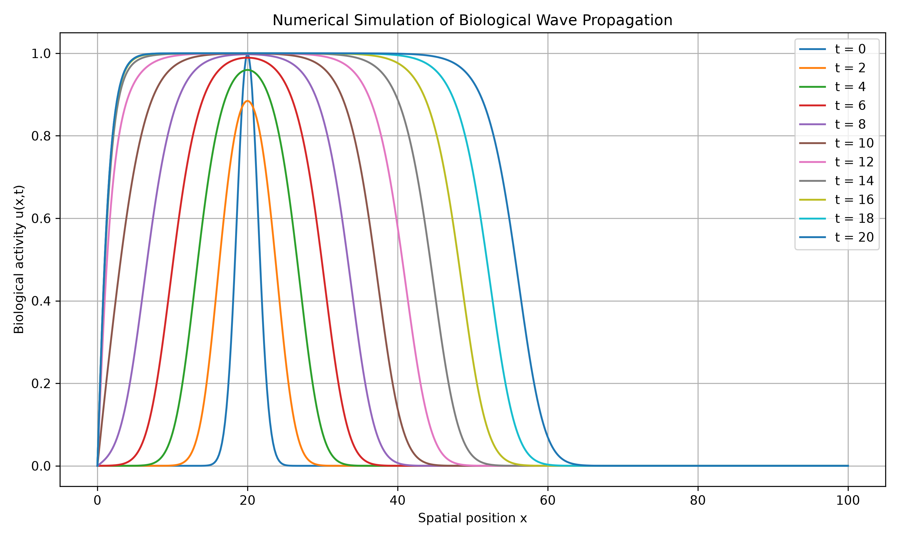
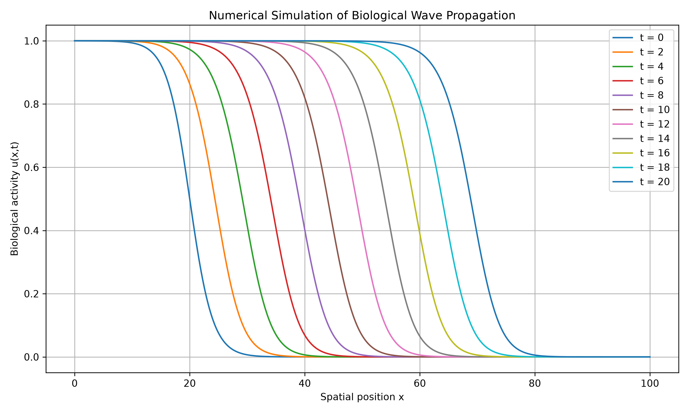
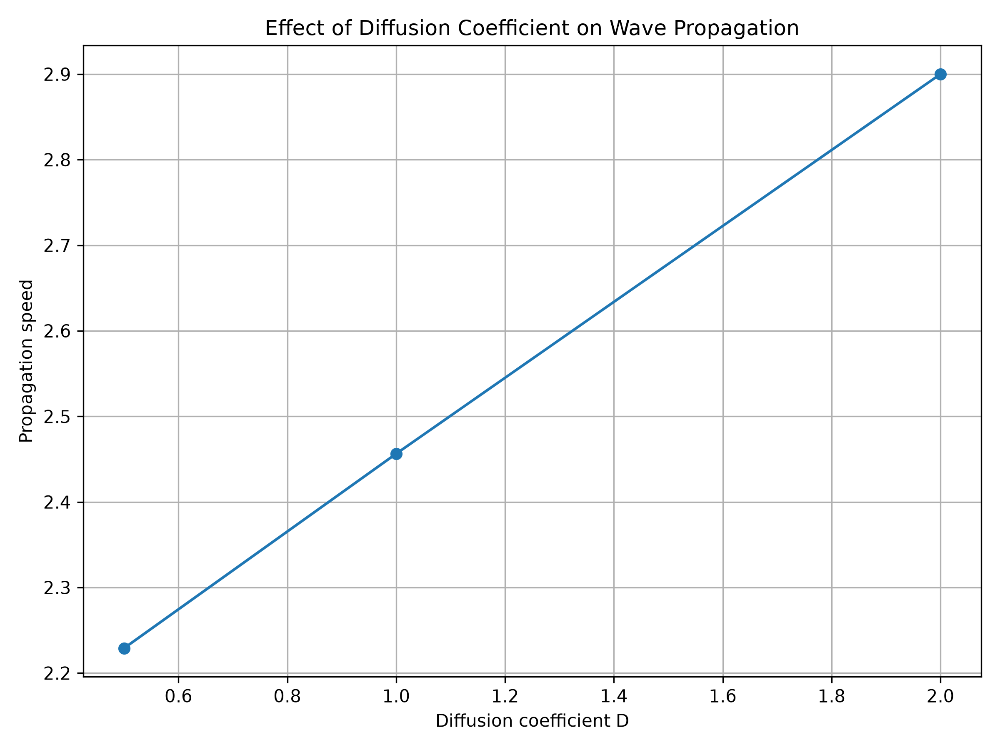

# Mathematical Modeling of Wave Propagation in Biological Systems
A mathematical modeling study of wave propagation in biological systems using nonlinear partial differential equations
## 1. Introduction

Wave propagation is an important phenomenon in many biological systems, including excitable tissues and neural systems. Mathematical models based on partial differential equations provide a useful framework for studying how biological signals propagate through space and evolve over time.

This project investigates wave propagation using a nonlinear reaction-diffusion partial differential equation. The aim is to develop a mathematical model, perform numerical simulations, and analyze how changes in model parameters influence wave behavior.

## 2. Research Question

How can nonlinear partial differential equations be used to mathematically model and analyze wave propagation in biological systems?

## 3. Objectives

The main objectives of this project are:

1. To formulate a nonlinear mathematical model for biological wave propagation.
2. To solve the model numerically.
3. To visualize the propagation of biological waves.
4. To investigate the influence of model parameters on wave behavior.
5. To discuss the potential relevance of reaction-diffusion models to biological systems.

## 4. Mathematical Model

To investigate biological wave propagation, this project considers the Fisher-KPP reaction-diffusion equation:

$$
\frac{\partial u}{\partial t} = D\frac{\partial^2 u}{\partial x^2}+ ru(1-u)$$

where:

- $u(x,t)$ represents the normalized biological activity or signal.
- $D$ is the diffusion coefficient.
- $r$ is the reaction or growth parameter.
- $x$ represents the spatial coordinate.
- $t$ represents time.

The diffusion term describes the spatial spreading of the biological signal, while the nonlinear reaction term represents local changes in biological activity.

## 5. Model Assumptions

The model assumes that:

1. The biological activity varies continuously in space and time.
2. Spatial propagation can be represented by a diffusion process.
3. Local biological dynamics are represented by a nonlinear reaction term.
4. The model parameters are constant during the simulation.

## 6. Preliminary Results

An initial Gaussian-profile simulation was performed as a preliminary test of biological wave propagation. The solution remained centered around x = 20 throughout the simulated time interval.

The peak-position analysis gave an estimated propagation speed of 0.0000 spatial units per time unit. This indicated that the Gaussian pulse did not exhibit translational motion of its maximum and therefore was not suitable for estimating traveling-wave speed using the peak-position method.

This preliminary result motivated the use of a sigmoid traveling-front profile for the subsequent propagation analysis.

**Figure 1.** Preliminary Gaussian-profile simulation at different time points.

## 7. Final Traveling-Wave Results

A sigmoid traveling-front profile was used to investigate the propagation of biological activity through the spatial domain. The wave front was tracked by identifying the position at which the solution satisfies $u = 0.5$ at each selected time point.

The numerical simulation showed a clear forward movement of the traveling front. The front position increased from x = 20.00 at t = 0 to x = 68.80 at t = 20.

A linear fit of the front position as a function of time gave an estimated propagation speed of:

$$
c = 2.4564
$$

spatial units per time unit.

These results demonstrate the propagation of the modeled traveling front and provide a quantitative estimate of its propagation speed.

### Traveling-Front Simulation

**Figure 2.** Numerical simulation of the sigmoid traveling front at different time points.

## 8. Quantitative Analysis

The position of the traveling wave front was estimated by tracking the spatial location where the solution satisfies $u = 0.5$.

The simulated front positions were:

| Time | Front Position |
|------|----------------|
| 0 | 20.00 |
| 2 | 24.40 |
| 4 | 29.20 |
| 6 | 34.00 |
| 8 | 39.00 |
| 10 | 44.00 |
| 12 | 49.00 |
| 14 | 54.00 |
| 16 | 58.80 |
| 18 | 63.80 |
| 20 | 68.80 |

A linear fit of front position against time gave an estimated propagation speed of:

$$
c = 2.4564
$$
spatial units per time unit.
The increasing front position demonstrates that the modeled biological activity propagates through the spatial domain over time.
## 9. Parameter Analysis

To investigate how diffusion influences biological wave propagation, simulations were performed using three different values of the diffusion coefficient $D$, while keeping the reaction parameter fixed at $r = 1.0$.

The estimated propagation speeds were:

| Diffusion Coefficient $D$ | Propagation Speed |
|----------------------------|-------------------|
| 0.5 | 2.2291 |
| 1.0 | 2.4564 |
| 2.0 | 2.9000 |

The results show that the propagation speed increases as the diffusion coefficient increases. In the simulated system, stronger diffusion leads to faster spatial propagation of the traveling front.

### Effect of Diffusion on Propagation Speed

**Figure 3.** Relationship between the diffusion coefficient and the estimated propagation speed.
## 10. Discussion

The numerical simulations demonstrate that the mathematical formulation can produce a propagating biological activity profile. The preliminary Gaussian simulation showed that the maximum of the solution remained approximately fixed at $x = 20$, resulting in a peak-based propagation speed of zero. This indicated that the Gaussian profile was not appropriate for estimating the speed of a traveling front using the peak-position method.

A sigmoid traveling-front profile was therefore considered for the subsequent analysis. In this case, the position of the $u = 0.5$ level was used to track the wave front. The front moved from $x = 20.00$ at $t = 0$ to $x = 68.80$ at $t = 20$, giving an estimated propagation speed of $2.4564$ spatial units per time unit.

The parameter analysis further showed that diffusion has a significant influence on the simulated propagation speed. Increasing the diffusion coefficient from $D = 0.5$ to $D = 2.0$ increased the estimated propagation speed from $2.2291$ to $2.9000$ spatial units per time unit. This behavior is consistent with the role of diffusion in transporting activity through the spatial domain.

The results demonstrate how nonlinear reaction-diffusion equations can be used as computational tools for studying propagation phenomena in biological systems. However, the present model is a simplified one-dimensional representation and does not capture the full complexity of real biological systems. More realistic models could incorporate additional variables, spatial dimensions, heterogeneous parameters, and experimentally measured biological data.
