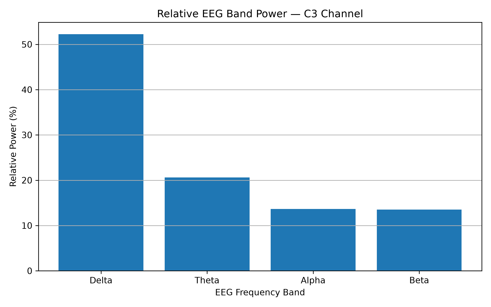
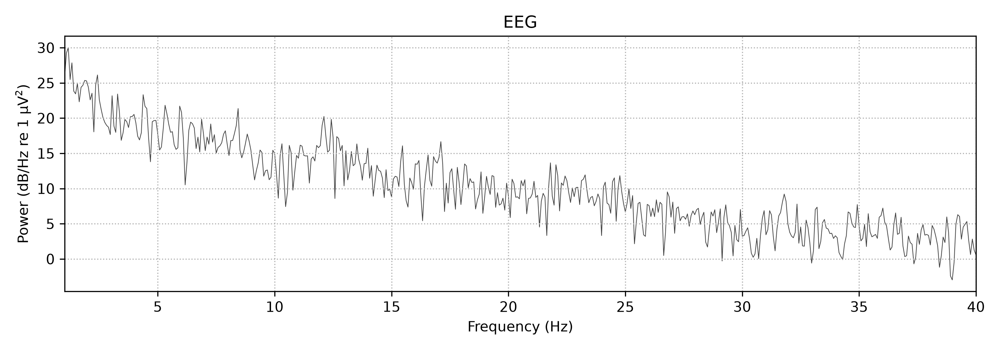
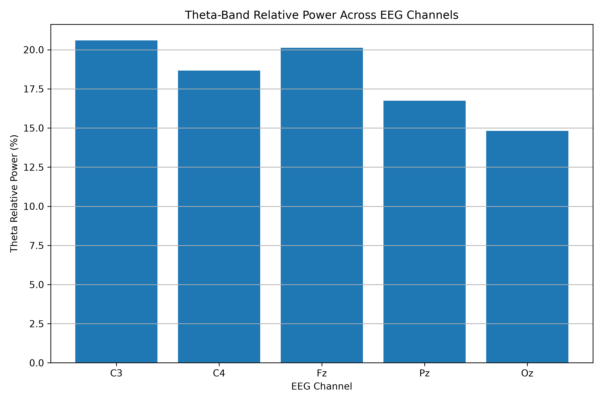

# Mathematical Modeling of Wave Propagation in Biological Systems
A mathematical modeling study of wave propagation in biological systems using nonlinear partial differential equations
## 1. Introduction

Wave propagation is an important phenomenon in many biological systems, including excitable tissues and neural systems. Mathematical models based on partial differential equations provide a useful framework for studying how biological signals propagate through space and evolve over time.

This project investigates wave propagation using a nonlinear reaction-diffusion partial differential equation. The aim is to develop a mathematical model, perform numerical simulations, and analyze how changes in model parameters influence wave behavior.

## 2. Research Question

How can nonlinear partial differential equations be used to mathematically model and analyze wave propagation in biological systems?

## 3. Objectives

The main objectives of this project are:

1. To formulate a nonlinear mathematical model for biological wave propagation.
2. To solve the model numerically.
3. To visualize the propagation of biological waves.
4. To investigate the influence of model parameters on wave behavior.
5. To discuss the potential relevance of reaction-diffusion models to biological systems.

## 4. Mathematical Model

To investigate biological wave propagation, this project considers the Fisher-KPP reaction-diffusion equation:

$$
\frac{\partial u}{\partial t} = D\frac{\partial^2 u}{\partial x^2}+ ru(1-u)$$

where:

- $u(x,t)$ represents the normalized biological activity or signal.
- $D$ is the diffusion coefficient.
- $r$ is the reaction or growth parameter.
- $x$ represents the spatial coordinate.
- $t$ represents time.

The diffusion term describes the spatial spreading of the biological signal, while the nonlinear reaction term represents local changes in biological activity.

## 5. Model Assumptions

The model assumes that:

1. The biological activity varies continuously in space and time.
2. Spatial propagation can be represented by a diffusion process.
3. Local biological dynamics are represented by a nonlinear reaction term.
4. The model parameters are constant during the simulation.

## 6. Preliminary Results

An initial Gaussian-profile simulation was performed as a preliminary test of biological wave propagation. The solution remained centered around x = 20 throughout the simulated time interval.

The peak-position analysis gave an estimated propagation speed of 0.0000 spatial units per time unit. This indicated that the Gaussian pulse did not exhibit translational motion of its maximum and therefore was not suitable for estimating traveling-wave speed using the peak-position method.

This preliminary result motivated the use of a sigmoid traveling-front profile for the subsequent propagation analysis.

**Figure 1.** Preliminary Gaussian-profile simulation at different time points.

## 7. Final Traveling-Wave Results

A sigmoid traveling-front profile was used to investigate the propagation of biological activity through the spatial domain. The wave front was tracked by identifying the position at which the solution satisfies $u = 0.5$ at each selected time point.

The numerical simulation showed a clear forward movement of the traveling front. The front position increased from x = 20.00 at t = 0 to x = 68.80 at t = 20.

A linear fit of the front position as a function of time gave an estimated propagation speed of:

$$
c = 2.4564
$$

spatial units per time unit.

These results demonstrate the propagation of the modeled traveling front and provide a quantitative estimate of its propagation speed.

### Traveling-Front Simulation

**Figure 2.** Numerical simulation of the sigmoid traveling front at different time points.

## 8. Quantitative Analysis

The position of the traveling wave front was estimated by tracking the spatial location where the solution satisfies $u = 0.5$.

The simulated front positions were:

| Time | Front Position |
|------|----------------|
| 0 | 20.00 |
| 2 | 24.40 |
| 4 | 29.20 |
| 6 | 34.00 |
| 8 | 39.00 |
| 10 | 44.00 |
| 12 | 49.00 |
| 14 | 54.00 |
| 16 | 58.80 |
| 18 | 63.80 |
| 20 | 68.80 |

A linear fit of front position against time gave an estimated propagation speed of:

**Estimated Propagation Speed:** `c = 2.4564` spatial units per time unit.
The increasing front position demonstrates that the modeled biological activity propagates through the spatial domain over time.
## 9. Parameter Analysis

To investigate how diffusion influences biological wave propagation, simulations were performed using three different values of the diffusion coefficient $D$, while keeping the reaction parameter fixed at $r = 1.0$.

The estimated propagation speeds were:

| Diffusion Coefficient $D$ | Propagation Speed |
|----------------------------|-------------------|
| 0.5 | 2.2291 |
| 1.0 | 2.4564 |
| 2.0 | 2.9000 |

The results show that the propagation speed increases as the diffusion coefficient increases. In the simulated system, stronger diffusion leads to faster spatial propagation of the traveling front.

### Effect of Diffusion on Propagation Speed

**Figure 3.** Relationship between the diffusion coefficient and the estimated propagation speed.
## 10. Discussion

The numerical simulations demonstrate that the mathematical formulation can produce a propagating biological activity profile. The preliminary Gaussian simulation showed that the maximum of the solution remained approximately fixed at $x = 20$, resulting in a peak-based propagation speed of zero. This indicated that the Gaussian profile was not appropriate for estimating the speed of a traveling front using the peak-position method.

A sigmoid traveling-front profile was therefore considered for the subsequent analysis. In this case, the position of the $u = 0.5$ level was used to track the wave front. The front moved from $x = 20.00$ at $t = 0$ to $x = 68.80$ at $t = 20$, giving an estimated propagation speed of $2.4564$ spatial units per time unit.

The parameter analysis further showed that diffusion has a significant influence on the simulated propagation speed. Increasing the diffusion coefficient from $D = 0.5$ to $D = 2.0$ increased the estimated propagation speed from $2.2291$ to $2.9000$ spatial units per time unit. This behavior is consistent with the role of diffusion in transporting activity through the spatial domain.

The results demonstrate how nonlinear reaction-diffusion equations can be used as computational tools for studying propagation phenomena in biological systems. However, the present model is a simplified one-dimensional representation and does not capture the full complexity of real biological systems. More realistic models could incorporate additional variables, spatial dimensions, heterogeneous parameters, and experimentally measured biological data.
## 11. Conclusion

This project investigated the mathematical modeling of biological wave propagation using the Fisher-KPP nonlinear reaction-diffusion equation.

A preliminary Gaussian-profile simulation was first examined. Since the maximum of the solution remained approximately fixed in space, its peak-based propagation speed was estimated as zero. This motivated the use of a sigmoid traveling-front profile for the subsequent analysis.

The traveling-front simulation demonstrated clear spatial propagation, with the front position increasing from $x = 20.00$ at $t = 0$ to $x = 68.80$ at $t = 20$. The estimated propagation speed was $2.4564$ spatial units per time unit.

Parameter analysis showed that increasing the diffusion coefficient resulted in increased propagation speed. The estimated speeds were $2.2291$, $2.4564$, and $2.9000$ for $D = 0.5$, $1.0$, and $2.0$, respectively.

Overall, the project demonstrates how nonlinear partial differential equations, numerical methods, and computational analysis can be combined to investigate wave propagation phenomena in biological systems. The model provides a simplified mathematical framework that can be further extended toward more realistic biological applications.
## 12. Tools and Technologies

The project was developed using the following computational tools:

- **Python** — numerical simulation and computational analysis
- **NumPy** — numerical calculations and array-based computation
- **Matplotlib** — visualization of wave profiles and parameter-analysis results
- **GitHub** — project documentation, version control, and reproducibility

## 13. Project Structure

The repository contains the following main files:

- `simulation.py` — numerical simulation of the Fisher-KPP traveling-wave model
- `parameter_analysis.py` — analysis of the effect of the diffusion coefficient on propagation speed
- `initial_gaussian_simulation.png` — preliminary Gaussian-profile simulation
- `travelling_wave.png` — final traveling-front simulation
- `diffusion_parameter_analysis.png` — diffusion coefficient versus propagation speed
- `README.md` — mathematical model, methodology, results, discussion, and conclusions
## 14. References

1. Fisher, R. A. (1937). The wave of advance of advantageous genes. *Annals of Eugenics*, 7(4), 355–369.
2. Kolmogorov, A., Petrovskii, I., & Piskunov, N. (1937). Étude de l'équation de la diffusion avec croissance de la quantité de matière et son application à un problème biologique. *Bulletin de l'Université d'État de Moscou, Série Internationale A*, 1, 1–25.
3. Murray, J. D. (2002). *Mathematical Biology I: An Introduction* (3rd ed.). Springer. https://doi.org/10.1007/b98868

4. Murray, J. D. (2003). *Mathematical Biology II: Spatial Models and Biomedical Applications* (3rd ed.). Springer. https://doi.org/10.1007/b98869

## 15. Future Work

The present study provides a simplified one-dimensional framework for investigating biological wave propagation. Several extensions can be considered for future research:

1. **Higher-dimensional modeling:** Extend the one-dimensional reaction-diffusion model to two- and three-dimensional spatial domains.

2. **Parameter sensitivity analysis:** Investigate the sensitivity of wave speed and wave structure to the diffusion coefficient, reaction parameter, and other model parameters.

3. **Heterogeneous biological media:** Introduce spatially varying diffusion and reaction parameters to represent heterogeneous biological environments.

4. **Comparison with biological data:** Compare numerical wave profiles with experimentally measured biological or neural signals where suitable datasets are available.

5. **More complex biological models:** Extend the framework toward coupled reaction-diffusion systems and more realistic models of biological signal propagation.

6. **Application to neural wave propagation:** Explore whether reaction-diffusion and traveling-wave models can be adapted to investigate wave-like activity in neural systems.

---

# Project 2 — Quantitative EEG Brain-Wave Analysis Using Mathematical and Computational Methods

## Overview

This project extends the mathematical modeling work toward real biological signals through quantitative analysis of electroencephalography (EEG) data.

The objective is to investigate the frequency characteristics of EEG signals and quantify theta-band activity across different brain regions using mathematical and computational methods.

## Dataset

The EEG data were obtained from the PhysioNet EEG Motor Movement/Imagery Dataset.

The recording contains 64 EEG channels sampled at 160 Hz.

## Methodology

The analysis includes:

1. EEG signal loading
2. Signal preprocessing
3. Frequency-domain analysis
4. Power spectral density analysis
5. EEG band-power calculation
6. Relative theta-power analysis
7. Multi-channel comparison
8. Statistical analysis
9. Time-frequency analysis

## EEG Frequency Bands

| Band | Frequency |
|---|---|
| Delta | 1–4 Hz |
| Theta | 4–8 Hz |
| Alpha | 8–13 Hz |
| Beta | 13–30 Hz |

## Theta-Band Analysis

Theta relative power was calculated for five EEG channels:

| Channel | Theta Relative Power |
|---|---:|
| C3 | 20.59% |
| C4 | 18.66% |
| Fz | 20.12% |
| Pz | 16.74% |
| Oz | 14.82% |

### Statistical Summary

- Mean theta power: **18.19%**
- Standard deviation: **2.41%**
- Minimum: **14.82%**
- Maximum: **20.59%**
- Range: **5.77%**
- Coefficient of variation: **13.23%**

The highest theta relative power was observed at C3 (20.59%), while the lowest was observed at Oz (14.82%).

## Results

### C3 Relative Band Power

### EEG Time-Frequency Analysis

### Theta Power Across EEG Channels

## Python Implementation

The main analysis scripts are:

- `eeg_analysis.py`
- `final_results.py`
- `mathematical_analysis.py`

## Scientific Significance

This project demonstrates how mathematical and computational methods can be applied to real biological signals.

It creates an interdisciplinary connection between:

**Applied Mathematics → Signal Processing → Computer Science → Physics → Biology → Neuroscience**

## Discussion

The EEG analysis shows measurable differences in theta-band relative power across the selected brain regions. Among the five analyzed channels, C3 showed the highest relative theta power (20.59%), followed by Fz (20.12%) and C4 (18.66%). Pz and Oz showed lower values of 16.74% and 14.82%, respectively.

The mean theta relative power across the selected channels was 18.19%, with a standard deviation of 2.41%. The coefficient of variation was 13.23%, indicating a moderate level of variation between the selected channels.

The higher theta relative power observed at C3 and C4 is particularly interesting because these electrodes are located over the central regions of the brain. However, these results should not be interpreted as evidence of a specific neurological condition. The analysis is exploratory and is based on a limited number of channels and a single recording.

From a mathematical and computational perspective, the analysis demonstrates how frequency-domain methods can be used to quantify characteristics of biological signals. The transformation of raw EEG measurements into band-power features provides a numerical representation that can subsequently be used for statistical analysis, mathematical modeling, or machine-learning applications.

The results also provide a useful starting point for connecting mathematical models of biological wave propagation with experimentally measured EEG signals. A more extensive analysis involving multiple subjects, repeated trials, and event-specific EEG segments would be required to investigate such relationships more rigorously.

## Conclusion

This project demonstrated a quantitative approach to analyzing real EEG signals using Python-based signal processing and mathematical analysis. EEG recordings from the PhysioNet EEG Motor Movement/Imagery Dataset were examined in the frequency domain, with particular emphasis on theta-band activity.

The analysis of five selected EEG channels showed theta relative power ranging from 14.82% to 20.59%, with a mean value of 18.19% and a standard deviation of 2.41%. C3 exhibited the highest theta relative power, while Oz exhibited the lowest among the selected channels.

These results demonstrate how mathematical and computational techniques can transform raw biological signals into quantitative features that can be compared across brain regions. The project also provides a foundation for future integration of EEG signal analysis with mathematical models of biological wave propagation.

Although the present analysis is exploratory and limited to selected channels and recordings, it establishes a reproducible computational framework that can be extended to larger datasets and more advanced mathematical or machine-learning methods.

## References

1. Schalk, G., McFarland, D. J., Hinterberger, T., Birbaumer, N., & Wolpaw, J. R. (2004). BCI2000: A general-purpose brain-computer interface (BCI) system. *IEEE Transactions on Biomedical Engineering, 51*(6), 1034–1043.  
   DOI: https://doi.org/10.1109/TBME.2004.827072

2. Goldberger, A. L., Amaral, L. A. N., Glass, L., Hausdorff, J. M., Ivanov, P. Ch., Mark, R. G., Mietus, J. E., Moody, G. B., Peng, C.-K., & Stanley, H. E. (2000). PhysioBank, PhysioToolkit, and PhysioNet: Components of a new research resource for complex physiologic signals. *Circulation, 101*(23), e215–e220.  
   DOI: https://doi.org/10.1161/01.CIR.101.23.e215

3. Cohen, M. X. (2014). *Analyzing Neural Time Series Data: Theory and Practice*. MIT Press.  
   DOI: https://doi.org/10.7551/mitpress/9609.001.0001

4. Schomer, D. L., & Lopes da Silva, F. H. (Eds.). (2018). *Niedermeyer's Electroencephalography: Basic Principles, Clinical Applications, and Related Fields* (7th ed.). Oxford University Press.  
   DOI: https://doi.org/10.1093/med/9780190228484.001.0001

5. PhysioNet. EEG Motor Movement/Imagery Dataset (EEGMMIDB).  
   https://physionet.org/content/eegmmidb/1.0.0/

6. MNE-Python. EEG and electrophysiological data analysis documentation.  
   https://mne.tools/stable/

## Future Work

Several extensions can be developed from the present analysis:

- Analysis of multiple subjects and multiple recording sessions.
- Event-based segmentation using the T0, T1, and T2 annotations.
- Comparison of left-fist, right-fist, and resting conditions.
- Automated EEG artifact detection and removal.
- Statistical testing of differences in theta power between conditions.
- Analysis of additional frequency bands and cross-channel relationships.
- Time-frequency analysis using wavelets or short-time Fourier transforms.
- Machine-learning methods for EEG pattern classification.
- Mathematical modeling of EEG-related biological wave propagation.
- Comparison between theoretical reaction-diffusion models and experimentally observed EEG dynamics.

## Limitations

The current analysis is exploratory and uses a limited selection of channels and recordings. The results should not be interpreted as clinical findings.

## Dataset Source

PhysioNet — EEG Motor Movement/Imagery Dataset

https://physionet.org/content/eegmmidb/1.0.0/

---

## Author

**Darain Fatima**

MPhil Mathematics — Applied Mathematics

Research interests include:

- Nonlinear partial differential equations
- Mathematical modeling
- Reaction-diffusion equations
- Biological wave propagation
- EEG signal analysis
- Computational mathematics
